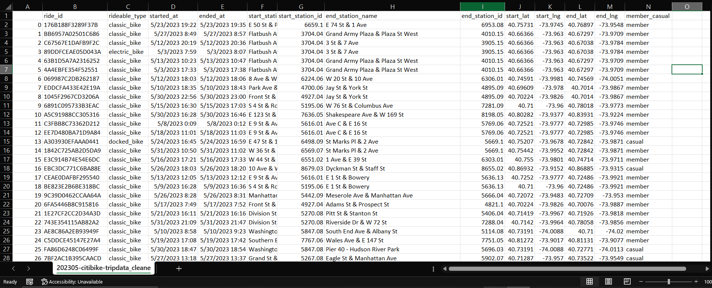
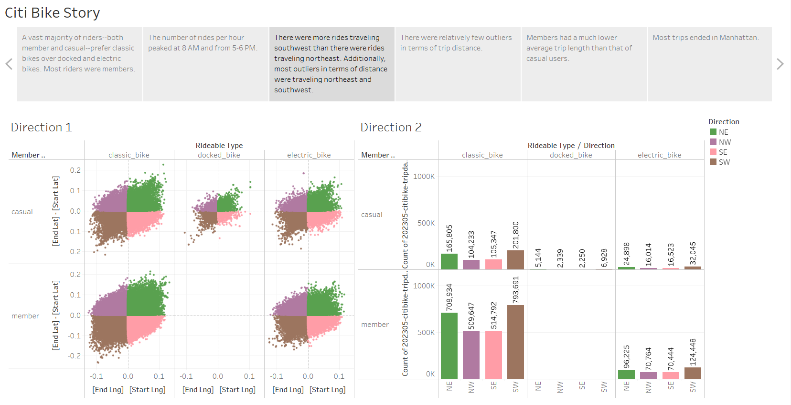
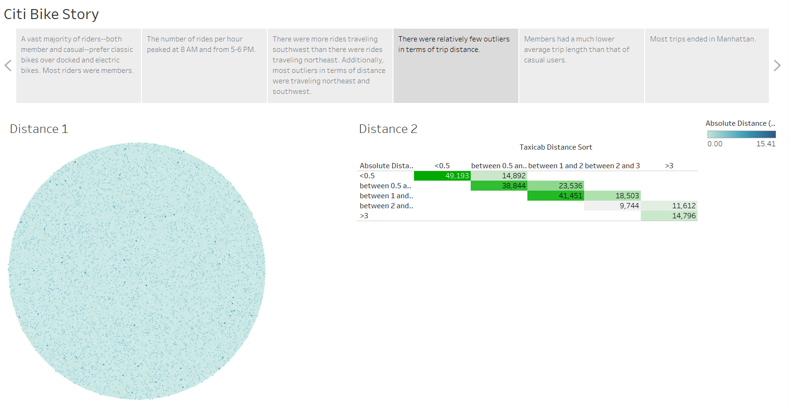
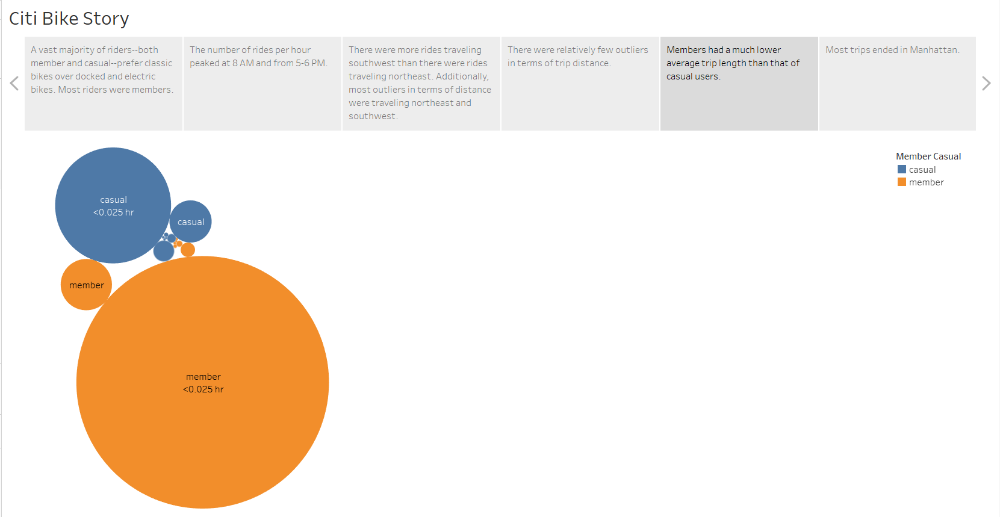
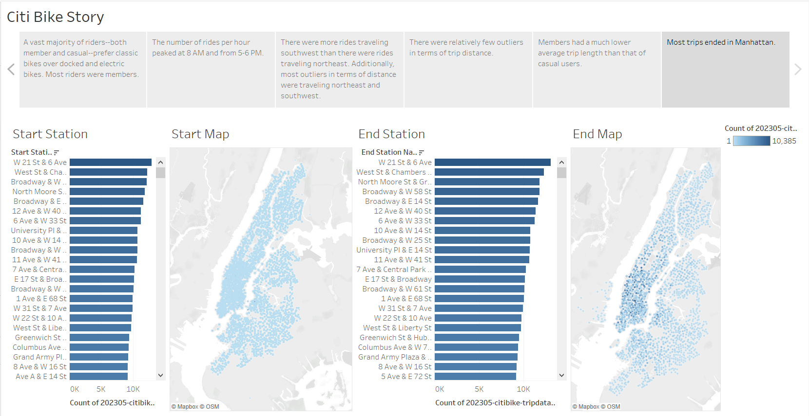

# tableau-challenge
Module 18 Tableau Challenge for the Vanderbilt Data Analytics Bootcamp 2023

The original dataset

A vast majority of riders--both member and casual--prefer classic bikes over docked and electric bikes. Most riders were members.

The number of rides per hour peaked at 8 AM and from 5-6 PM. 

There were more rides traveling southwest than there were rides traveling northeast. Additionally, most outliers in terms of distance were traveling northeast and southwest. 

There were relatively few outliers in terms of trip distance. 

Members had a much lower average trip length than that of casual users. 

Most trips ended in Manhattan. 
