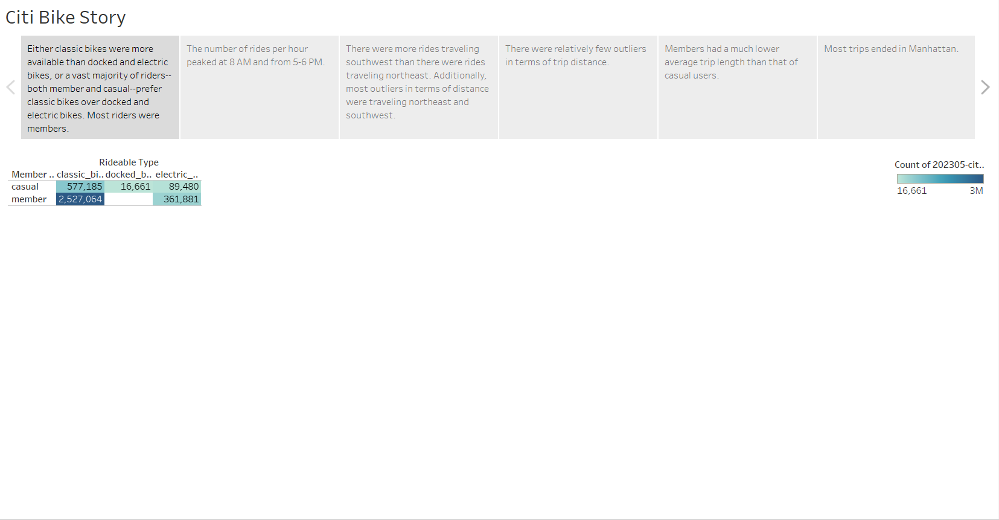
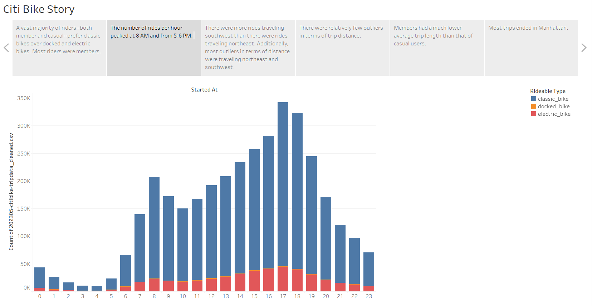

# tableau-challenge
Module 18 Tableau Challenge for the Vanderbilt Data Analytics Bootcamp 2023

# About Tableau
Tableau is a data visualization tool. It essentially allows one to input a csv file and then create graphs using that data. More information can be found [here](https://en.wikipedia.org/wiki/Tableau_Software). 

# The Project
The original dataset

A vast majority of riders--both member and casual--prefer classic bikes over docked and electric bikes. Most riders were members.

The number of rides per hour peaked at 8 AM and from 5-6 PM. 

We used the `start_lng`, `end_lng`, `start_lat`, and `end_lat` columns to determine which direction each rider was going. There were more rides traveling southwest than there were rides traveling northeast. Additionally, most outliers in terms of distance were traveling northeast and southwest. 

There were relatively few outliers in terms of trip distance. The majority of the color in this bubble chart is light blue, with only a handful of dark blue specks. 

Members had a much lower average trip length than that of casual users. 

Most trips ended in Manhattan. 
